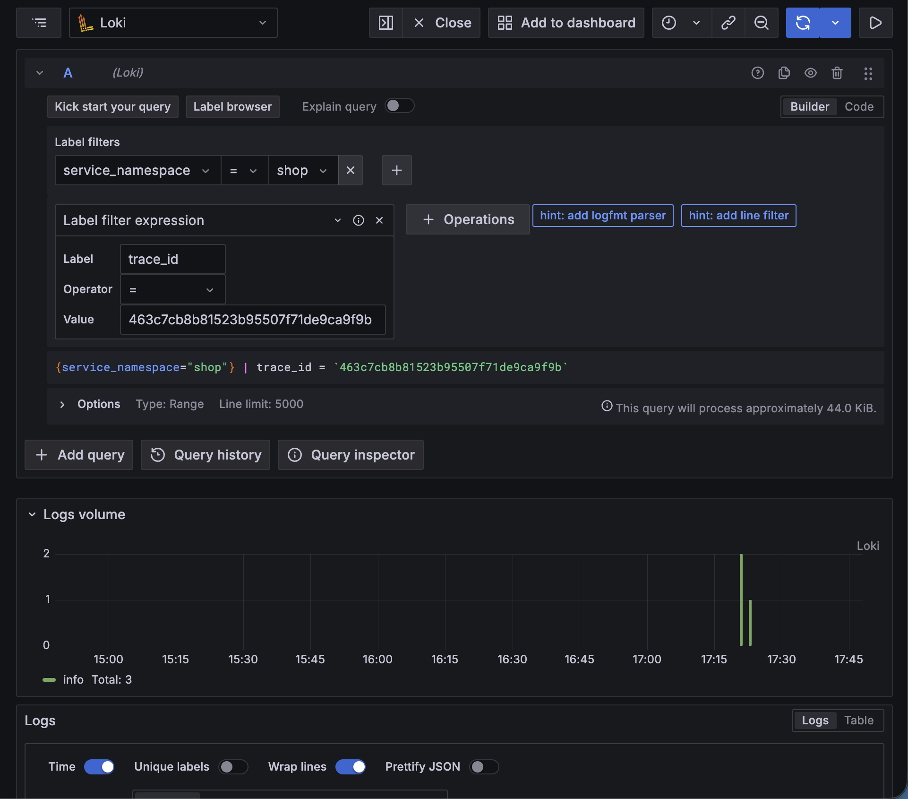
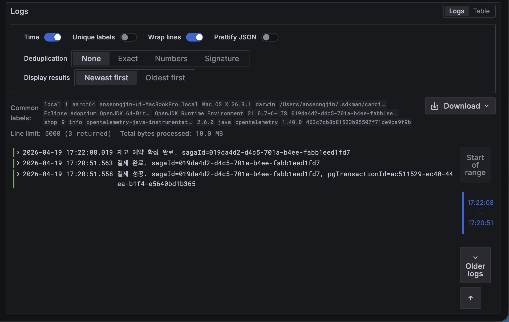

## Explore > Loki 
### Label filters
- services_name : shop
  - 참고로 service_instance_id, deployment_environment, service_name 등을 고를 수 있다.
- Label filter expression 
  - Label : trace_id 
  - operator : =
  - value : 463c7cb8b81523b95507f71de9ca9f9b




- 동일한 네임스페이스 shop 에서 동일한 trace_id 에 대한 shop-stock, shop-order, shop-payment 의 로그를 검색한 것이다.

---

## structured metadata 의 핵심 사용법

```logql
{service_namespace="shop"} | trace_id="4bf92f3577b34da6a3ce929d0e0e4736"
```

이 쿼리는 Loki 3.0+ OTLP 경로에서 **네이티브로 동작**해요. `trace_id` 는 OTLP log record 의 최상위 필드로 들어가는데, Loki 네이티브 OTLP endpoint 가 이걸 자동으로 structured metadata 에 저장하거든요. `| json` 이나 `| logfmt` 같은 파서 거치지 않아도 됨.

### 어떻게 돌아가는지 (내부 동작)

```
OTel Agent → OTLP LogRecord {
  trace_id: "4bf92f3577b34da6a3ce929d0e0e4736"   ← LogRecord 최상위 필드
  span_id:  "00f067aa0ba902b7"
  body: "order created: 12345"
  ...
}

Loki /otlp endpoint 수신
  ↓
자동으로 structured metadata 로 저장:
  trace_id: "4bf92f3577b34da6a3ce929d0e0e4736"
  span_id:  "00f067aa0ba902b7"

LogQL 쿼리 엔진
  ↓
{service_namespace="shop"}         → 라벨 매치 (인덱스 사용)
  | trace_id="4bf92..."            → structured metadata 매치 (인덱스 없지만 빠름)
```

### trace_id 검색 응용 예시

**1) 단일 trace 보기**

```logql
{service_namespace="shop"} | trace_id="4bf92f3577b34da6a3ce929d0e0e4736"
```

해당 trace 에 속한 **모든 서비스의 모든 로그** 가 시간순으로 펼쳐짐. 예를 들어:

```
17:22:05.110  shop-order    OrderEntity created
17:22:05.150  shop-order    DB commit: orders
17:22:05.203  shop-order    payment-requested 발행
17:22:05.312  shop-payment  payment-requested 수신
17:22:05.420  shop-payment  FakePG 호출
17:22:05.520  shop-payment  payment-success 발행
```

**2) 여러 trace 한 번에**

```logql
{service_namespace="shop"} | trace_id=~"4bf92f35.*|cb0e484f.*"
```

regex 로 여러 trace 동시 검색.

**3) trace + level 복합**

```logql
{service_namespace="shop", level="error"} | trace_id="4bf92f3577b34da6a3ce929d0e0e4736"
```

해당 trace 에서 에러만 빠르게.

**4) trace 있는 것만 (sampling 확인용)**

```logql
{service_namespace="shop"} | trace_id=~".+"
```

trace_id 가 주입된 로그만 필터. "내 로그에 trace 가 제대로 붙고 있나?" 점검용.

### 주의할 점 (hex 포맷)

OTLP trace_id 는 **32자 hex, 대시 없음**:

```
✓ 4bf92f3577b34da6a3ce929d0e0e4736       # OTel 표준
✗ 4bf92f35-77b3-4da6-a3ce-929d0e0e4736   # UUID 스타일, OTel 아님
```

Tempo 에서 복사해올 때 대시가 들어간 형태면 지워야 해요. Grafana 의 Tempo 패널에서 trace ID 클릭하면 이미 hex 로 복사됨.

### sagaId vs trace_id — 언제 뭘 쓸까

| 목적 | 쓸 것 |
|---|---|
| "주문 1건의 전체 Saga 여정" | `mdc_sagaId` |
| "하나의 HTTP/Kafka 호출 체인" | `trace_id` |
| Tempo 에서 점프해 온 상태 | `trace_id` |
| 주문 실패 원인 역추적 | `mdc_sagaId` 먼저 → 특정 단계 `trace_id` |

**왜 구분되나?** Saga 는 Kafka 경계를 넘으며 **새 trace 가 시작되는 경우가 있음**. 예를 들어 shop-order 가 publish 한 메시지를 shop-payment 가 consume 할 때, Kafka consumer span 이 새 root trace 를 시작하기도 해요 (OTel Kafka 인스트루멘테이션 설정에 따라 다름). 이 경우 하나의 saga 에 trace_id 가 2~3개 존재.

그래서 실무에서는:

```logql
# 먼저 saga 전체 흐름
{service_namespace="shop"} | mdc_sagaId="01HV9..."

# 그 중 특정 단계가 이상해서 파고들 때
{service_namespace="shop"} | trace_id="4bf92..."
```

이 두 쿼리를 왕복하는 패턴이 가장 자주 씀.

### Grafana 에서 편하게 — 원클릭 네비게이션

로그 detail 에서 `trace_id` 필드 옆에 **🧭 아이콘** 이 자동 생성돼요. 누르면 바로 Tempo 로 점프. 반대로 Tempo trace 뷰에서 span 클릭 → **Logs for this span** 버튼 누르면 아래 쿼리가 자동 실행됨:

```logql
{service_name="shop-order"} |= "4bf92f3577b34da6a3ce929d0e0e4736"
```

단, Grafana 가 자동 생성하는 쿼리는 아직 `|=` substring 으로 박히는데 이건 `grafana/provisioning/datasources/loki.yml` 의 `tracesToLogsV2.customQuery` 를 structured metadata 방식으로 바꾸면 더 빨라져요:

```yaml
tracesToLogsV2:
  customQuery: true
  query: '{service_name="$${__span.tags["service.name"]}"} | trace_id="$${__span.traceId}"'
  #                                                        ^^^^^^^^^^^^^^^^^^^^^^^^^^^^^^^
  #                                                        |= 대신 structured metadata 매치
```

지금 설정 파일 상태가 어떤지 볼까요, 아니면 바로 이 최적화 적용해드릴까요?